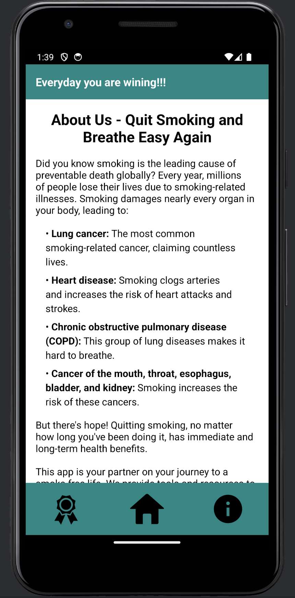

# Quit Smoking Android App [UNDER CONSTRUCTION]

Quit Smoking Android is an application designed to help users quit smoking by providing helpful insights, tools, and resources.

## Features

- **Track Progress:** Monitor your progress in real-time to stay motivated on your journey to quit smoking.
- **Cost Analysis:** Calculate the amount of money you save by quitting smoking and visualize your savings over time.
- **Health Benefits:** Learn about the health benefits of quitting smoking and track improvements in your health metrics.
- **Community Support:** Connect with a community of users who are also on their journey to quit smoking, share tips, and support each other.

## Screenshots

## Getting Started

To get started with Quit Smoking Android, follow these steps:

1. **Download:** Clone or download the repository to your local machine.
2. **Open in Android Studio:** Open the project in Android Studio.
3. **Build and Run:** Build and run the app on your Android device or emulator.

## Contributing

Contributions are welcome! If you'd like to contribute to Quit Smoking Android, please follow these guidelines:

1. Fork the repository and clone it to your local machine.
2. Create a new branch for your feature or bug fix.
3. Make your changes and ensure that the code passes all tests.
4. Commit your changes and push them to your fork.
5. Submit a pull request, detailing the changes you've made and any relevant information.

## License

Quit Smoking Android is released under the [MIT License](LICENSE). See the [LICENSE](LICENSE) file for details.

## Support

For support, bug reports, or feature requests, please [open an issue](https://github.com/inandi/smoke/issues) here on GitHub.
